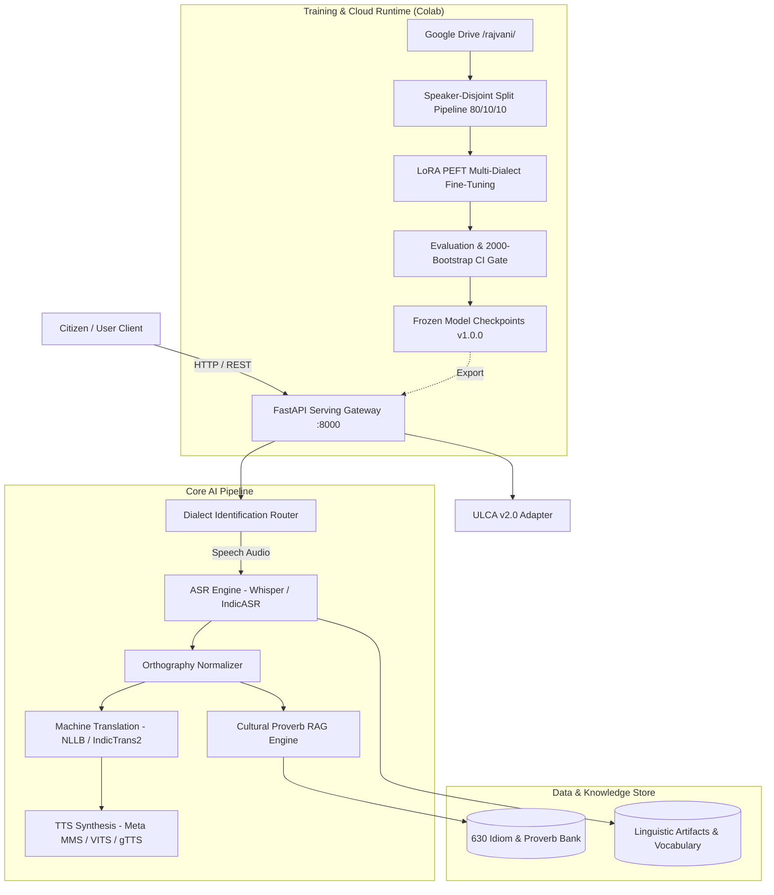

# System Architecture — Rajvani (राजवाणी)

## System Architecture
Rajvani is designed with a decoupled, high-performance modular architecture that bridges cloud-based model training (Google Colab / Google Drive) with local/edge inference serving (FastAPI, Gradio, and HTML5 Web UI).

## Components

### 1. Dialect Identification (DID) Router (`dialect_id/`)
- Analyzes phonetic acoustic features or text token distributions to identify the input dialect among `MWR`, `MTR`, `DHD`, `HDT`, `MWT`, and `BGR`.
- Routes payload to the dialect-specialized normalization rules and LoRA adapter weights.

### 2. Speech-to-Text ASR Engine (`training/train_asr.py`, `serving/providers/`)
- Converts raw input speech (16kHz WAV / MP3) to dialect text transcripts.
- Incorporates dynamic acoustic noise reduction and silence trimming.

### 3. Orthography Standardizer (`linguistic_artifacts/normalizers/`)
- Resolves high dialectal variance in Devanagari spellings (e.g. standardizing *म्हारो/महारो*, *छै/छे*, *कोनी/कोनि*).

### 4. Neural Machine Translation (`training/train_mt.py`)
- Translates dialect sentences to Standard Hindi (`hin_Deva`) and English (`eng_Latn`).
- Preserves agricultural and cultural vocabulary without hallucinations.

### 5. Dialect Voice Synthesizer (`training/train_tts.py`)
- Generates natural, regional dialect audio with authentic cadence and pronunciation.

### 6. Cultural Proverb & Idiom RAG Store (`linguistic_artifacts/idiom_bank/`)
- Curated vector search engine over 630 cultural proverbs providing regional context, Hindi meaning, and English translation.

## Data Flow

1. **User Audio Input**: User records or uploads audio via Web UI or API.
2. **Pre-Processing**: Audio is resampled to 16kHz mono; dialect ID classifies or receives dialect header.
3. **ASR Inference**: Dialect acoustic model produces raw Devanagari transcript.
4. **Orthography Normalization**: Deterministic regex and morphological lookup standardize the transcript.
5. **Machine Translation**: Normalized text is translated into standard Hindi/English.
6. **Cultural Enrichment (Optional RAG)**: If an idiom/proverb is detected, the cultural gloss and origin district are attached.
7. **Speech Synthesis**: The translated or normalized text is converted into dialect or standard speech audio.
8. **Response Delivery**: JSON payload returned with transcript, translations, cultural metadata, and base64/URL audio.

## Frontend
- **Interactive Web App (`serving/web/`)**: Clean, responsive interface featuring voice recording, dialect selection, real-time waveform visualizer, translation panels, and audio playback.
- **Gradio Multi-Tab Studio (`Untitled2.ipynb`)**: Multi-task demonstration dashboard for live cloud demonstrations.

## Backend
- **FastAPI Gateway (`serving/api/main.py`)**: High-concurrency async REST API with CORS support, structured Pydantic schema validation, and health/metrics endpoints.
- **BHASHINI ULCA Adapter (`serving/api/ulca_adapter.py`)**: Standardized MeitY ULCA v2.0 endpoint compatibility.

## Database & Storage
- **File System / Parquet**: High-throughput partitioned Parquet files (`data/splits/<dialect>/*.parquet`) and JSONL for dataset streaming.
- **Linguistic Artifacts**: Canonical JSONL records in `linguistic_artifacts/idiom_bank/`.
- **Cloud Storage**: Google Drive persistent directory structure (`/content/drive/MyDrive/rajvani/`).

## AI Components & Models
- **ASR**: `openai/whisper-small` / `whisper-medium` + LoRA PEFT adapters.
- **MT**: `facebook/nllb-200-distilled-600M` & `ai4bharat/indictrans2-indic-indic-1B`.
- **TTS**: `facebook/mms-tts` VITS architectures + `gTTS` fallback.
- **Evaluation**: Non-parametric bootstrap resampling ($B=2000$) with deterministic seeding.

## Deployment Architecture
- **Local Dev / Edge**: Docker & `docker-compose.yml` hosting FastAPI with CPU/GPU runtime.
- **Cloud Training**: Google Colab T4 GPU with zero-local-disk footprint saving checkpoints to Google Drive.
